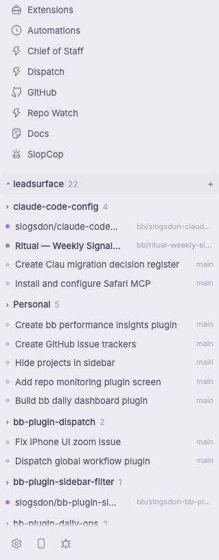

# bb-plugin-sidebar-filter

A [bb](https://getbb.app) plugin that replaces the sidebar thread list with a
project-grouped version that **hides projects without active threads**.

If you work across many projects, the built-in sidebar (in its "project"
organization mode) shows **every** project as a collapsible row — including
projects whose threads are all archived. This list drops those rows entirely,
so the sidebar only shows projects that actually have something in them.

## Screenshots



*The sidebar with sidebar-filter enabled: project groups, collapsed where idle.*

## Install

```sh
bb plugin install path:path/to/bb-plugin-sidebar-filter
# or
bb plugin install https://github.com/slogsdon/bb-plugin-sidebar-filter
```

## Enable

The sidebar list slot is exclusive and opt-in per client:

1. Open **Settings → Appearance → Sidebar**.
2. Choose **Sidebar Project Filter** from the list provider picker.

Until you pick it, the built-in list stays. If the plugin is disabled or
crashes, bb falls back to the built-in list automatically.

## Configuration

```sh
bb plugin config sidebar-filter set hideEmptyProjects true
bb plugin config sidebar-filter set activeMode exists   # or running
```

| Setting             | Default  | Meaning                                                        |
| ------------------- | -------- | -------------------------------------------------------------- |
| `hideEmptyProjects` | `true`   | Hide projects with no matching threads. `false` shows them all. |
| `activeMode`        | `exists` | `exists` — non-archived thread counts. `running` — only threads currently running (indicator `runtime` or live workflows/background agents/goals/plan mode). |

## What the list does

- One collapsible row per project, in bb's project order; a project appears
  only when it has matching threads.
- Pinned threads in their own **Pinned** section on top, like the built-in
  list.
- Live updates: projects appear/disappear as threads start, finish, or are
  archived — no refresh.
- Keyboard support (`thread.next` / `thread.previous` / numbered shortcuts)
  via the host's `data-sidebar-thread-*` contract.
- Middle-click opens a thread in a split; hover shows the split-drag
  affordance.
- The host search field filters rows (and projects) live.
- Right-click a thread row for a menu: pin/unpin, mark read/unread, archive,
  delete (through bb's own confirmation flow).

## What it deliberately leaves out

- The New-thread/search row, plugin nav rows, and footer stay host-rendered
  (bb's thread-list contract forbids plugins from touching them).
- No "chronological sections" or "machine" organization modes — the list is
  project-organized only. If you want sections, this plugin is not it.
- Child threads render flat inside their project (indented hierarchy is
  built-in-list behavior; this list keeps it simple).
- The collapse state of project rows persists per client (localStorage).

## How it works

- Backend (`server.ts`): declares the two settings above. Nothing else.
- Frontend (`app.tsx`): registers the exclusive `experimental_threadList`
  slot and renders `experimental_useSidebarThreads()` data — the exact same
  live cache the built-in list uses — filtered by the settings.

## Development

```sh
bb plugin dev    # rebuild + reload on save
bb plugin build .   # emit dist/
```

Reference: `examples/plugins/t3sidebar` in the [bb repo](https://github.com/get-bb/bb) — the canonical sidebar thread-list replacement.